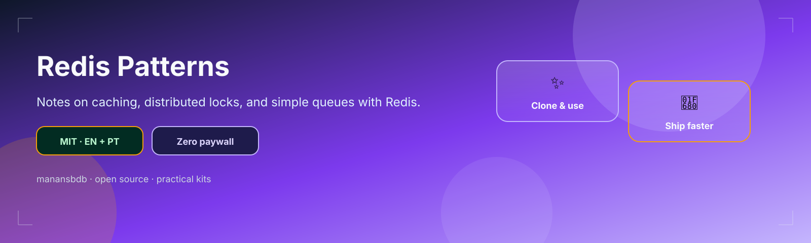
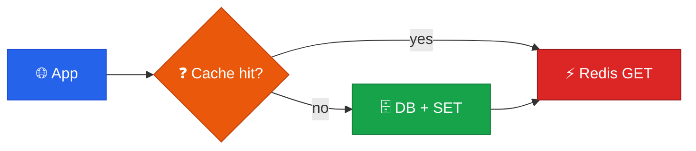

<p align="center">
  
</p>

<h1 align="center">redis-patterns</h1>

<p align="center">
  <strong>EN</strong> Cache, lock & queue patterns with key-naming notes<br/>
  <strong>PT</strong> Padrões de cache, lock e filas com notas de naming de keys
</p>

<p align="center">
  <a href="https://github.com/manansbdb/redis-patterns/blob/main/LICENSE"></a>
  
  
  <a href="#support--apoio"></a>
</p>

---

## What it does / Para que serve

| English | Português |
|---------|-----------|
| Notes on common **Redis patterns**: cache-aside, distributed locks, and simple queues. | Notas sobre **padrões Redis** comuns: cache-aside, locks distribuídos e filas simples. |
| Includes key-naming conventions to avoid collisions. | Inclui convenções de naming de keys para evitar colisões. |



---

## Install / Instalação

### 1) Clone / Clona

```bash
git clone https://github.com/manansbdb/redis-patterns.git
cd redis-patterns
```

### 2) Copy notes / Copia as notas

```bash
mkdir -p docs/redis
cp patterns.md docs/redis/patterns.md
cp key-naming.md docs/redis/key-naming.md
```

### Requirements / Requisitos

- `git`
- Optional: Redis server for trying patterns locally

---

## Quick start / Início rápido

```bash
git clone https://github.com/manansbdb/redis-patterns.git
cd redis-patterns
# read patterns.md + key-naming.md before adding Redis to your app
```

---

## Contents / Conteúdos

| Path | Purpose / Função |
|------|------------------|
| `patterns.md` | Cache / lock / queue patterns |
| `key-naming.md` | Key namespace conventions |
| `SUPPORT.md` | Donations / Doações |

---

## Project layout / Estrutura

```text
redis-patterns/
├── docs/banner.svg
├── patterns.md
├── key-naming.md
├── SUPPORT.md
└── README.md
```

---

## Support / Apoio

Bitcoin donations welcome / Doações em Bitcoin bem-vindas:

```
bc1q0qfnlnxyum9u45stzxe0a7jnhtj4j0usfkqdjw
```

See [SUPPORT.md](./SUPPORT.md).

---

## License / Licença

[MIT](./LICENSE) © 2026 manansbdb
